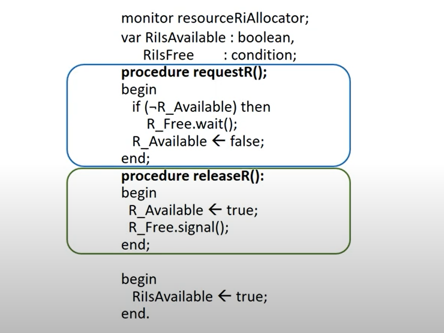
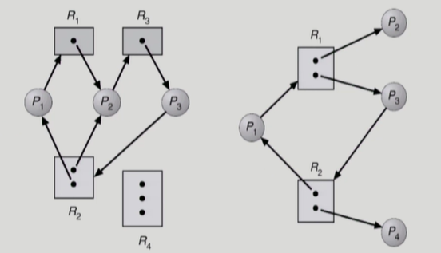
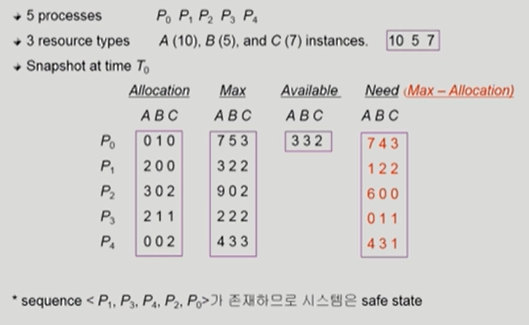
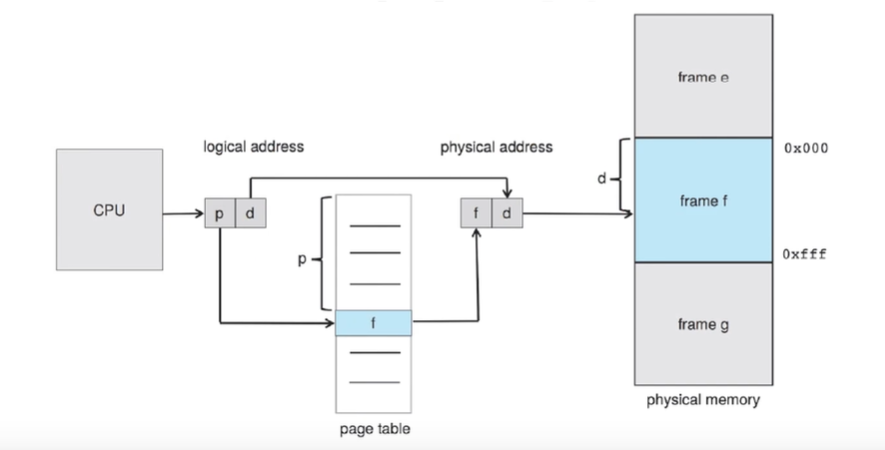
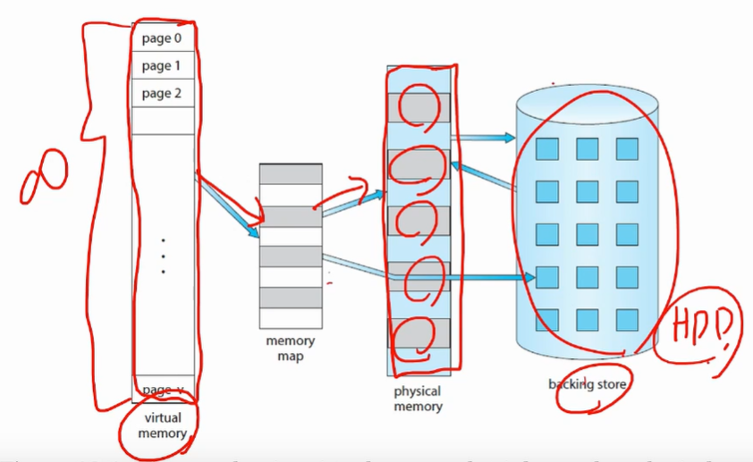
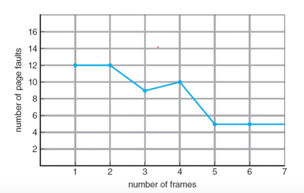
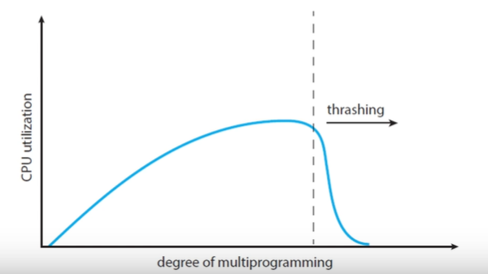
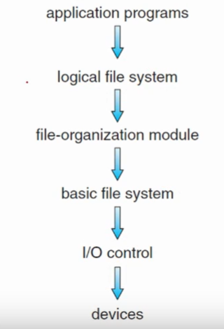

# OS-2021-1

- **과제**

    Assignment 1: 리눅스 배포판 설치 및 커널 컴파일

    Assignment 2: 리눅스 쉘 구현, 멀티 프로세싱/멀티 스레딩을 이용한 병합 정렬 구현

    `Shell` `Multi Processing` `Multi Threading` `Merge Sort`

    Assignment 3: 스케줄러와 메모리 관리 기법이 결합된 시뮬레이터 구현

    `CPU Scheduling` `Memory Management` `Buddy System` `Paging` `Virtual Memory`

- **개념**

    ## 1. What is operating system?

    ### Computer

    정보를 처리하는 기계

    ### A stored-program computer(von Neumann architecture)

    메모리에 program(set of instructions)을 저장하고 CPU에서 순차적으로 처리(fetch-execute)

    ### OS

    컴퓨터 시스템을 운영하는 소프트웨어
    컴퓨터에서 항상 실행되고 있는 프로그램
    OS kernel이 기능의 핵심
    하드웨어와 application program, user간의 interface
    - User interface - CLI(shell), GUI - Application programming interface - system call

    Application program에게 system service 제공
    User가 시스템에 대해 알지 못해도 됨
    Ex) program execution, I/O operation, memory management, file system..

    ### Multiprogramming

    Memory에 여러 개의 process을 올려놓음(I/O operation동안 다른 process 실행)

    ### Multiprocessing

    여러 개의 processor가 process를 병렬 처리

    ### Time sharing

    다른 process로 CPU core를 매우 빠르게 교체하여 동시에 처리하는 것처럼 보이게 함

    ### CPU scheduling

    CPU가 준비 상태에 있는 process 중 어떤 것을 실행시킬지 선택

    ### Dual mode operation

    user mode & kernel mode
    Kernel mode에서만 하드웨어를 직접적으로 제어할 수 있게 함으로써 프로그램의 잘못된 동작 방지

    ## 3. Thread & Concurrency

    ### Multithreading

    Thread: light weight process CPU가 실행하는 단위가 process -> thread
    Thread 별로 다른 program counter, register set, stack 정보를 가지고, 같은 code, data, file 정보를 가짐
    장점
    - Responsiveness
    Process가 다 실행되지 못하고 block 됐을 때, thread를 추가하고 실행을 계속할 수 있음 - Resource sharing
    Thread는 process의 resource를 공유하므로 통신에 용이 - Economy
    Process를 추가하는 것보다 thread를 추가하는게 경제적임(context switching-thread switching) - Scalability
    Multiprocessor architecture를 활용하기 좋음

    ### Multicore system

    - single core: time sharing을 통해 concurrent하게 실행
    - multi core: 병렬 처리
    어떤 task를 나누고 어떻게 나눌 것인지가 중요

    ### Multithreading Models

    - user thread: user mode에서 사용하는 thread - kernel support x
    - kernel thread: kernel mode에서 사용하는 thread - 운영체제가 직접 관리

    user thread - kernel thread -> 1:1, 1:M, M:N 관계 존재

    ### Implicit Threading

    Concurrent & parallel application(multithreading in multicore system)을 개발하는게 쉽지 않음 -> compiler나 run-time library가 대신 하도록 함
    Ex) Thread Pool, Fork & Join, OpenMP, GCD

    ## 5. Process Synchronization

    Cooperating process들이 공유 데이터에 동시에 접근할 때 data inconsistency 발생 가능
    -> 순서 보장 필요
    - concurrent execution
    interrupt에 의해 context switch가 일어나 다른 process에 CPU core 할당 - parallel execution 분리된 CPU core에 의해 여러 process가 실행됨

    Ex) producer-consumer problem
    두개의 process가 buffer를 이용하여 asynchronously(동작을 맞추지 않음)하게 실행되며 데이터 공유

    count++, count–

    

    

    count에 5가 저장되어야 하지만 경우에 따라 4, 5, 6이 저장됨

    ### Race Condition(경쟁 상황)

    여러 processes(threads) 간 공유 데이터로의 접근 순서에 따라 실행 결과가 달라지는 상황
    이를 방지하기 위해서 process(thread) synchronization이 필요

    ### Critical Section Problem(임계 영역 문제)

    각 process의 코드 영역 중 공유 데이터에 접근하는 코드 영역(code segment)
    코드 영역은 크게 4가지로 나뉨 - entry section: critical section에 진입하기 위한 허가 요청 영역 - critical section - exit section: critical section에서 나오는 영역 - remainder section

    ### Mutual Exclusion(상호 배제)

    한 process가 critical section을 실행하고 있으면, 다른 process들은 critical section을 실행할 수 없음
    -> race condition 방지(Synchronization)

    ### Progress

    deadlock 방지
    critical section을 실행하고 있는 process가 없으면, critical section에 진입할 다음 process를 선택하는 것이 지연돼서는 안됨

    ### Bounded Waiting

    starvation 방지
    critical section에 진입할 수 있는 시간을 한정하여 다른 process들의 critical section이 영원히 실행되지 못하는 것 방지

    ## SW Solutions

    ### Peterson Algorithm

    아키텍처에 따라 제대로 동작하지 않을 수 있음
    mutual exclusion, progress, bounded waiting 증명 가능

    

    Alt text

    ## HW Solutions

    Critical-section problem 해결을 위해 hardware instruction 제공 ### Atomic Operation 더이상 나눌 수 없는 operation 단위(1clock에 실행)
    Atomic instruction을 만들어 문제 해결
    -> interrupt 불가 -> mutual exclusion 보장
    Ex) test_and_set(), compare_and_swap() 이를 이용하여 atomic variable 생성

    ## OS Solution

    ### Semaphore

    P(), V()라는 atomic operation으로만 접근 가능한 정수형 변수
    -> OS가 전체 operation이 한 instruction cycle에 수행되도록 보장

    

    Alt text

    Semaphore(S)가 0이면 critical section을 실행 중인 process가 있고, 1이면 없다는 의미
    -> mutual exclusion 보장

    But, multi processor 시스템에서만 사용 가능(parallel execution)

    ## Language-Level Solution

    SW, HW, OS Solution -> Low-level mechanism => 사용하기 어려움, error 발생 확률 높음
    Language-Level Solution -> High-level Mechanism => 프로그래밍 언어 단에서 해결 ### Monitor 최대 하나의 process만 접근할 수 있는 공유 데이터와 critical section의 집합
    구조 - entry queue: 모니터 내 함수 수만큼 존재 - condition queue: 특정 이벤트를 기다리는 process가 대기 - signaler queue: 신호 제공을 위한(signal 명령을 실행한) process가 임시 대기

    특징 - mutual exclusion: 모니터 내에는 하나의 process만 진입 가능 - information hiding: 공유 데이터는 모니터 내의 process만 접근 가능

    모니터 내에 자원을 요청하는 function, 자원을 반납하는 function 존재
    자원을 할당 받을 수 있을 때를 기다리는 condition queue에 signaler queue에서 신호 제공

    

    Alt text

    과정 1. 처음 도착한 process(p1)가 자원 요청 2. 자원이 p1에 할당되고 p1이 모니터에서 나감 3. p2, p3가 요청을 위한 entry queue에 도착 4. p2가 모니터에 들어와 자원 요청 5. 하지만 모니터에 자원이 없으므로 condition queue로 이동 6. p1이 자원 사용을 끝내고 반납을 위한 entry queue에 도착 7. p1이 모니터에 들어와 자원 반납 8. p1이 signaler queue로 이동 후 condition queue에 신호 전달 9. p2가 모니터에 들어와 자원 할당 받은 후 나감 10. p1이 다시 모니터에 들어와 남은 일을 수행하고 나감

    장점 - 사용이 쉬움 - error 발생 가능성 낮음(ex.deadlock)

    단점 - 지원하는 언어에서만 사용 가능 - 컴파일러가 OS를 이해해야 함

    ---

    ## 6. Deadlock

    ### 정의

    Process들이 서로가 가진 자원을 기다리며 block된 상태
    각자 일부 자원을 가지고 있는 상태에서 상대방의 자원을 요구할 때 발생

    ### Resource

    하드웨어, 소프트웨어를 포함하는 개념
    Ex) I/O device, CPU cycle, memory space**Process의 자원 사용 절차**
    Request -> Allocate -> Use -> Release

    ### 발생 조건

    - Mutual exclusion(상호배제)
    매 순간 하나의 process만이 자원 사용 가능
    - Non-preemption(비선점)
    process의 자원을 강제로 빼앗지 못함
    - Hold and wait(보유대기)
    자원을 가진 process가 추가 자원을 얻기 위해 자원을 계속 가지고 있음
    - Circular wait(순환대기)
    process 서로의 자원을 기다리는 사이클이 형성됨

    ### Resource-Allocation Graph(자원 할당 그래프)

    Deadlock 확인 방법
    P: process
    R: resource
    P -> R: request edge
    R -> P: assignment edge

    

    Alt text

    1 -> deadlock
    2 -> deadlock x - 그래프에 cycle(화살표를 따라 시작으로 돌아옴)이 없으면 deadlock이 아님 - 그래프에 cycle이 있고, cycle에 포함된 resource에 하나의 instance만 있으면 deadlock

    ### 처리 방법

    방지

    - Deadlock Prevention

    자원 할당 시 deadlock의 4가지 필요 조건 중 하나를 차단

    But 여러 제약 조건으로 자원 이용률(utilization), 성능(throughput) 저하 - Deadlock Avoidance

    Deadlock의 가능성이 없는 경우에만 자원 할당

    Process가 시작될 때 해당 process가 평생 쓸 자원의 양을 파악하여 deadlock 가능성 파악 후 자원 할당 결정

    -> process가 추가로 필요한 최대(평생 쓸) 자원의 양이 가용 자원보다 많으면 할당하지 않고, 자원 반납을 통해 가용 자원이 추가되면 다시 확인

    => 최악의 상황을 고려

    Ex) Banker’s Algorithm

    

    처리
    - Deadlock Detection and Recovery
    Deadlock 발생은 허용하되 발견 시 recover
    Banker’s Algorithm을 낙관적으로 사용하여 detection
    => 최선의 상황을 고려
    Deadlock에 연루된 process들을 모두 종료시키거나, 하나씩 자원을 빼앗아서 recover - Deadlock Ignorance
    Deadlock을 시스템이 책임지지 않음
    Deadlock은 빈번히 발생하는 것이 아니기 떄문에 미연에 방지하기 위해 조치를 취하는 것이 더 많은 overhead 발생시킴 -> 대부분 이 방식 사용

    ## 7. Memory Management

    ### Main Memory

    주소를 가지는 byte 단위의 array로 구성됨
    CPU는 program counter를 이용하여 memory에서 instruction fetch
    base register와 limit register를 이용하여 접근 주소 범위 결정

    ### Address binding

    Program은 binary file로 디스크에 저장되어 있음
    Program을 실행시키기 위해선 memory로 가져와야됨 -> process

    

    Alt text

    Logical address: CPU에서 사용하는 user program의 주소
    Physical address: memory의 주소

    **MMU(Memory Management Unit)**

    logical address를 physical address로 매핑하는 하드웨어

    

    ### Dynamic Loading

    전체 program을 memory에 저장하는게 아니라 호출될 때만 load
    -> memory 공간 utilization 향상

    ### DLL(Dynamically Linked Libraries)

    User program이 실행될 때 link되는 system library
    Main memory에 하나의 DLL instance만 존재 -> 여러 user process끼리 공유

    ## Memory Allocation

    ### Contiguous Memory Allocation

    Process를 통채로 memory에 할당
    다른 process가 할당된 영역과 연속적으로 존재

    ### Variable-Partition scheme

    가장 간단한 contiguous memory allocation 방식
    Process마다 다른 크기의 memory partition 할당
    각 partition에는 하나의 process만 존재하기 때문에 process가 바뀌면서 hole 발생
    해결 방법
    - First-Fit: 크기가 충분한 첫번째 hole에 할당 - Best-Fit: 크기가 충분하고 가장 작은 hole에 할당 - Worst-Fit 가장 큰 hole에 할당

    **Fragmentation** - External fragmentation
    Memory가 작은 크기의 여러 hole로 쪼개져, 전체 남은 공간은 많지만 연속적인 공간이 부족하여 할당할 수 없는 문제 - Internal fragmentation
    Process 크기가 애매하여 partition내의 사용되지 않는 memory 발생 문제

    ### Paging

    Process의 physical address space가 non-contiguous함

    Physical memory를 고정된 크기의 block(frames), logical memory를 같은 크기의 black(pages)로 쪼갬

    Logical address = page number + page offset

    Page table을 통해 page number로부터 frame number를 찾음

    

    ### PTBR(page-table base register)

    Page table은 memory에 두고, CPU의 PTBR을 이용하여 page table을 가리킴
    Context switching을 빠르지만, memory 접근 속도가 느림

    ### TLB(Translation Look-aside Buffer)

    Cache memory 하드웨어를 통해 접근
    Page number가 TLB에 있으면 TLB hit, 없으면 TLB miss
    Hit ratio: TLB hit 비율

    ### Memory Protection

    Valid-invalid bit
    page table의 각 entry에 포함
    연관된 page가 process의 logical address space에 있는지 확인

    ### Page table structure

    Logical address space가 점차 커짐에 따라 page table도 커져야됨 - Hierarchical Paging
    Logical address space를 여러 table로 쪼갬 - Hashed Page Table
    Hash table을 이용하여 virtual page number 관리 - Inverted Page Table
    Logical address에 pid 추가

    ### Swapping

    Backing store를 이용하여 process를 memory에서 꺼냈다 넣었다 함(swap)
    Process들의 전체 physical address space가 실제 physical memory를 초과할 수 있게 함
    오늘날에는 Swapping + paging 합쳐서 사용

    ## 8. Virtual Memory

    메모리에 완전히 올라가지 않은 process를 실행할 수 있게 하는 기술
    -> program이 physical memory보다 커도 됨

    

    virtual memory와 physical memory를 매핑하고, 실제 memory에 loading되지 않는 page들은 backing store(ex.HDD)에 저장**Page sharing을** 통해 file과 memory 공유가 쉬워짐

    ### Demand Paging

    Page를 요청할 때만 memory에 올림
    Memory에 page가 없어도 process 실행 가능
    Process가 실행 중일 때는 memory에 있거나 secondary storage에 존재
    이를 구분하기 위해서 valid-invalid bit scheme 사용 - valid: page가 legal하고 memory에 존재 - invalid: page가 valid하지 않거나 secondary storage에 존재

    ### Page Fault

    메모리에 loading이 안된 page에 접근했을 때 발생**Handling Procedure**
    1. Valid인지 invalid인지 구분하기 위해 internal table 체크 2. valid -> terminate, valid이지만 page fault -> page in 3. memory의 빈 영역인 free frame 찾음 4. secondary storage에서 desired page를 읽어서 새로운 frame에 할당 5. Page가 valid하다는 것을 나타내기 위해 internal table과 page table 수정 6. Restart instruction

    

    ### Locality of Reference(참조 국부성)

    Program이 각 instruction마다 몇개의 새로운 page에 접근 -> instruction마다 multiple page faults 발생 가능
    But 실제로 잘 발생하지 않고, program은 참조 국부성을 가지려 하기 때문에 demand paging을 통해 좋은 performance를 가져옴
    Ex) Code와 data는 균일하게 access되지 않고 주로 특정 부분만 access됨
    -> demand paging을 통해 page fault를 줄이고 system performance를 향상시킬 수 있음

    ### Hardware support

    - page table
    vaild 또는 invalid 마킹
    - secondary memory(swap space)
    memory에 존재하지 않는 page를 가지고 있음
    Ex) SSD, HDD

    ### Instruction Restart

    Page fault 이후 process의 같은 공간, 상태에서 instruction 재실행
    Page fault가 instruction fetch 단계에서 발생하면 다시 fetch

    ### Free Frame List

    Page fault가 발생했을 때, desired page를 secondary storage에서 memory로 가져오려면 free frame을 알아야 함
    Linked list로 구성된 free frame list 이용

    ### Demand Paging Performance

    **Effective access time**

    

    대부분 read하는데 시간 소비

    ## Page Replacement

    Free frame이 없을 경우, 현재 사용하지 않는 frame 하나를 비움(secondary storage로)

    해당 content를 swap space에 write하고 해당 page를 invalid로 page table 수정

    

    Algorithm - page fault 수를 최소화하는 것이 중요

    ### FIFO Page replacement

    가장 오래된 page를 먼저 교체

    **Belady’s Anomaly**

    일반적으로 frame이 많을수록 page fault는 줄어들지만, 어느 지점에서 page fault가 늘어나는 현상

    

    ### Optimal Page replacement(OPT)

    가장 오랜 기간 사용되지 않을 것 같은 page 교체
    가장 적은 page fault rate 보장
    Belady’s anomaly를 겪지 않음
    But 예측이 필요하므로 다른 알고리즘과의 비교에 주로 사용됨

    ### LRU Page Replacement

    **Least Recently Used**
    Page가 마지막으로 사용된 시간을 기록해놓고, 사용되지 않은 기간이 가장 긴 page 교체
    이를 위해 하드웨어 지원 필요 -> counter, stack - Counter implementation
    Page가 참조될 때마다 counter 복사
    가장 작은 값을 가지는 page 교체 - Stack implementation
    Stack에 page number 저장
    중간에서 pop 가능
    Bottom에 있는 page 교체
    - Reference bit
    0으로 초기화된 상태에서 참조되면 1로 변경
    reference bit이 0인 것 교체

    ### Second-Chance Algorithm

    FIFO 기반
    하지만 reference bit이 1이면 한번 더 기회를 주고 다음 FIFO page 선택

    ### Frame Allocation

    - Equal
    모든 process에게 동일한 frame 공유
    - Proprotional
    Process의 크기에 따라 다르게 할당
    - Local
    자신에게 할당된 frame 중에서 선택
    - Global
    System의 모든 frame 중에서 선택

    ### Thrashing

    Process가 충분한 page를 가지지 않으면 page fault rate이 매우 높아짐

    빈번한 page in and out으로 인해 CPU utilization이 급격히 떨어지는 현상

    

    **Working-Set Model**
    만약 page가 active하면 working set에 존재
    만약 더이상 사용되지 않으면 working set에서 제외
    Working set에 있는 것만 load => Thrashing 완화

    ## 9. Storage Management

    ### Mass-Storage

    비휘발성 메모리, secondary storage system

    Ex) HDD, NVM

    magnetic tapes, optical disks, cloud storage => RAID system

    

    ### HDD Scheduling

    **목표**
    access time(seek time) 최소화
    데이터 전송 bandwidth 최대화

    - seek time
    device arm이 cylinder의 특정 sector를 찾아가는 데에 걸리는 시간
    * disk bandwidth
    한번에 전송될 수 있는 bytes / 시간

    ### FIFO

    ### SCAN

    disk arm이 디스크의 한 쪽 끝에서 시작하여 다른 쪽 끝으로 이동

    ### C-SCAN

    SCAN과 같지만 다른 쪽 끝에 가면 돌아올 때 요청을 수행하지 않고 시작점으로 바로 돌아옴
    cylinder를 circular list처럼 다룸

    ### Boot Block

    전원이 연결되었을 때 컴퓨터를 구동시킴
    가장 먼저 실행되는 program인 bootstrap loader가 NVM flash memory(ROM)에 저장되어 있음

    ### RAID

    Redundant Arrays of Independent Disks
    Disk-organization 기술 집합
    병렬 처리(striping)를 통해 data가 읽고 쓰여지는 비율 향상
    Redundant 정보가 mutiple device에 저장될 수 있기 때문에(mirroring) data storage의 reliability 향상 -> 정보 손실 방지

    - Parallelism
    multiple drives => transfer rate 향상

    ## I/O System

    컴퓨터의 두 가지 주요 기능: I/O(UI), computing(CPU)
    OS는 I/O operation, I/O device를 관리

    ### Memory-Mapped I/O

    Control register들이 processor의 주소 공간으로 매핑됨
    CPU는 표준 데이터 전송 instruction을 이용하여 physical memory에 매핑된 위치에 있는 device-control register 읽고 씀

    ### I/O types

    - polling(busy waiting)
    status register를 busy bit이 clear될 때까지 반복하여 읽음
    - interrupt
    CPU가 interrupt-request line이라는 wire를 가지고 있어 interrupt를 발견하면 ISR로 jump하여 interrupt 처리
    - DMA(Direct Memory Access)
    programmed I/O를 사용하지 않음
    대용량 데이터 전송에 주로 사용

    ### Blocking vs Non-Blocking

    - Blocking I/O
    Thread가 중단됨(running -> waiting)
    - Non-Blocking I/O
    Thread를 중지시키지 않고 그대로 return
    - Asynchronous system call
    Thread가 계속 실행됨

    ## File System

    Data와 program에 접근하기 위한 online(logical) storage
    File, directory로 구성

    ### Access Method

    - sequential access
    - direct access(random)

        

    ### Allocation Method

    File에 공간을 어떻게 할당할 것인지
    - Contiguous Allocation
    각 file을 통째로 할당
    external fragmentation 발생 - Linked Allocation
    각 file을 storage block의 linked list로 연결
    Sequential-access file에만 효과적 - FAT(File Allocation Table)
    Table에 linked list의 index 저장 - Indexed Allocation
    Block의 pointer들을 index block에 저장

    ## 10. Security and Protection

    ### Security

    정보의 integrity를 보호하기 위해 사용자 인증 보장 unauthorized access, malicious destruction, accidental introduction 등 으로부터 computer resource 보호

    ### Security Violation

    - threat - accidental
    - attack - intentional(malicious)

    **Type** - confidentiality - integrity - availability - Theft of service - Denial of service(Dos)

    ### Security Level

    - physical
    - network
    - operating system
    - application

        

    ### Program Threat

    - Malware
    Code injection으로 computer system에 공격을 주는 소프트웨어
    Ex) Trojan horse, spyware, ransomware
    - Viruses and Worms
    다른 program을 감염시키거나 network을 이용하여 퍼짐

    ### System and Network Threat

    - sniffing
    숨어서 network traffic을 가로챔
    - spoofing
    집단에 속해있는 것처럼 속이거나, 두 peer간 transaction을 가로챔
    - Denial of Service
    정보를 훔치는 것을 목표로 하지 않고, 사용자들의 system 사용을 괴롭힘
    - Port Scanning
    원래 공격 용도는 아니지만 취약점을 찾아내 악용될 수 있음

    ### Cryptography(암호화)

    암호화를 통해 OS가 두 peer가 주고 받는 network message를 검증할 필요가 없게 함
    Key를 이용하여 암호화, 복호화 과정을 거침

    **Encryption**
    Key를 가지고 있는 receiver만이 message를 읽을 수 있음 => ciphertext를 plaintext로 decrypt 가능 - symmetric: 암호화, 복호화에 같은 key 사용 - asymmetric: 암호화, 복호화에 다른 key 사용 -> public key, private key

    ### Authentication

    Encryption이 receiver를 제한하는 것이라면, authentication은 sender를 제한
    Hash function을 사용하여 고정된 크기로 암호화하고 verificate(복호화x)
    전자 서명에 많이 사용

    ## Protection

    OS로부터 권한을 부여받은 process만 resource를 사용하게 함
    사용자에게 system 접근에 대한 허가 제한

    ### Least Privileage

    Process, user에게 최소한의 권한 부여(permission)

    ### Protection Method

    - Access matrix: access control list에 접근 권한 포함
    - Sandboxing: running process에서 할 수 있는 것 제한
    - code Signing: program에 전자 서명 부여
